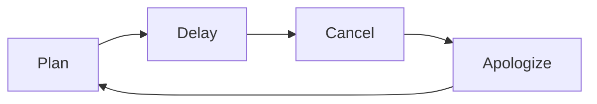

<picture>
  <source srcset="docs/lobsterjs-dark.png" media="(prefers-color-scheme: dark)">
  
</picture>

# lobster.js

> Extended Markdown parser for rich, structured web pages — works in the browser and Node.js.

**[Demo & Docs →](https://Hacknock.github.io/lobsterjs/)** · **[Showcase →](https://Hacknock.github.io/lobsterjs-showcase/)** · **[Try on StackBlitz →](https://stackblitz.com/github/Hacknock/lobsterjs-playground)**

lobster.js takes a Markdown file with its own extended syntax and turns a near-empty HTML page into a fully structured document — no build step, no framework.
It provides **document structure only**; appearance is entirely up to CSS via predictable `lbs-*` class names.

```html
<!DOCTYPE html>
<html>
  <head>
    <link rel="stylesheet" href="your-style.css" />
    <!-- bring your own CSS -->
  </head>
  <body>
    <div id="content"></div>
    <script type="module">
      import { loadMarkdown } from "./lobster.js";
      loadMarkdown("./content.md", document.getElementById("content"));
    </script>
  </body>
</html>
```

lobster.js outputs semantic HTML with `lbs-*` class names. No stylesheet is bundled in the package — styling is entirely up to you. Ready-to-use CSS themes are provided in [`docs/themes/`](./docs/themes/) for quick starts and inspiration.

---

## Features

- **All standard Markdown** — headings, paragraphs, bold, italic, strikethrough, code, blockquotes, lists, tables, links, images
- **Extended syntax** unique to lobster.js:
  - `:::header` / `:::footer` — semantic page header and footer regions
  - `:::details` — native collapsible `<details>` / `<summary>` blocks
  - `:::warp` + `[~id]` — define content once, place it anywhere (great for multi-column layouts)
  - Silent tables (`~ | … |`) — borderless layout grids
  - Table cell merging — horizontal (`\|`) and vertical (`\---`) colspan/rowspan
  - Image sizing — ``
  - Heading anchors — `## My Section {#my-section}` adds an `id` attribute for deep linking
  - Footnotes — reference (`[^id]`) and inline (`^[text]`)
- **CSS-first styling** — all elements get `lbs-*` class names; bring your own stylesheet
- **Multi-file loading** — pass an array of paths to `loadMarkdown` to merge multiple Markdown files into one page; all warp/link/footnote definitions are shared across files
- **Platform-agnostic core** — `src/core/` has zero DOM/browser dependencies; portable to Node.js, Deno, and potentially native mobile
- **TypeScript** — full type definitions included

---

## Installation

### CDN / local file

The latest build is available via GitHub Pages:

```html
<script type="module">
  import { loadMarkdown } from "https://hacknock.github.io/lobsterjs/lobster.js";
  loadMarkdown("./content.md", document.getElementById("content"));
</script>
```

Or download `lobster.js` from the [releases page](https://github.com/Hacknock/lobsterjs/releases) and host it yourself.

### npm / pnpm

```sh
npm install @hacknock/lobster
# or
pnpm add @hacknock/lobster
```

```ts
import { toHTML } from "@hacknock/lobster";
const html = toHTML("# Hello\n\nThis is **lobster**.");
```

---

## API

### `toHTML(markdown: string): string`

Convenience one-liner. Parses and renders Markdown to an HTML string.

```ts
import { toHTML } from "@hacknock/lobster";
const html = toHTML("# Hello");
```

### `parseDocument(markdown: string): Document`

Parses Markdown into an AST. Useful for inspecting or transforming the document tree before rendering.

```ts
import { parseDocument } from "@hacknock/lobster";
const doc = parseDocument(markdown);
console.log(doc.body); // BlockNode[]
```

### `renderDocument(doc: Document): string`

Converts a `Document` AST into an HTML string.

```ts
import { parseDocument, renderDocument } from "@hacknock/lobster";
const html = renderDocument(parseDocument(markdown));
```

### `loadMarkdown(src: string | string[], container?: HTMLElement): Promise<void>`

Fetches one or more Markdown files and renders them into the given DOM element (defaults to `document.body`). Browser only.

When an array is passed, all files are fetched in parallel, concatenated with a blank line, and parsed as a single document — so warp/link/footnote definitions are shared across all files.

```ts
import { loadMarkdown } from "@hacknock/lobster";

// Single file
await loadMarkdown("./content.md", document.getElementById("content"));

// Multiple files — fetched in parallel, merged before parsing
await loadMarkdown(["./shared.md", "./content.md"], document.getElementById("content"));
```

---

## Syntax overview

Standard Markdown works as you would expect. The sections below highlight lobster.js-specific extensions.

### Page layout blocks

```
:::header
# My Site
:::

:::footer
© 2025 My Site
:::
```

### Collapsible sections

```
:::details Click to expand
Hidden content goes here.
:::
```

### Multi-column layout with Warp

```
~ |             left              |             right             |
~ | :---                          | :---                          |
~ | [~col-left]                   | [~col-right]                  |

:::warp col-left
Left column content
:::

:::warp col-right
Right column content
:::
```

### Image sizing

```


```

### Footnotes

```
Lobster[^1] is great. So is inline^[No definition needed] footnotes.

[^1]: A crustacean — or a Markdown parser.
```

### Table cell merging

```
| A | B \|   |     ← B and the next cell merge horizontally
| \--- | C |       ← first cell merges with the one above
```

For the full syntax reference see [markdowns/spec.md](./markdowns/spec.md) (English) or [markdowns/spec-ja.md](./markdowns/spec-ja.md) (日本語).

---

## CSS classes

Every rendered element carries a `lbs-*` class name so any stylesheet can target it.
For the complete HTML output reference, minimum viable stylesheet, dark mode tips, and
an AI prompt template, see **[markdowns/styling.md](./markdowns/styling.md)**.

Quick reference:

| Class                                                      | Element                  |
| :--------------------------------------------------------- | :----------------------- |
| `lbs-heading-1` … `lbs-heading-6`                          | Headings (`<h1>`…`<h6>`) |
| `lbs-paragraph`                                            | Paragraph                |
| `lbs-emphasis` / `lbs-strong` / `lbs-strikethrough`        | Inline decorations       |
| `lbs-code-span` / `lbs-code-block` / `lbs-code-filename`   | Code                     |
| `lbs-blockquote`                                           | Blockquote               |
| `lbs-ul` / `lbs-ol` / `lbs-list-item` / `lbs-checkbox`     | Lists                    |
| `lbs-table` / `lbs-table-silent`                           | Tables                   |
| `lbs-header` / `lbs-footer`                                | Page regions             |
| `lbs-details` / `lbs-summary`                              | Collapsible              |
| `lbs-footnote-ref` / `lbs-footnotes` / `lbs-footnote-item` | Footnotes                |

---

## Themes

The repository ships several ready-to-use stylesheets you can copy and adapt:

| File                                                     | Style                                             |
| :------------------------------------------------------- | :------------------------------------------------ |
| [`docs/style.css`](./docs/style.css)                     | **Default** — clean, minimal, light               |
| [`docs/themes/pop.css`](./docs/themes/pop.css)           | **Pop** — bright, rounded, playful (coral/pink)   |
| [`docs/themes/pastel.css`](./docs/themes/pastel.css)     | **Pastel** — soft, dreamy, gentle (lavender/mint) |
| [`docs/themes/formal.css`](./docs/themes/formal.css)     | **Formal** — strict, professional, serif (navy)   |
| [`docs/themes/engineer.css`](./docs/themes/engineer.css) | **Engineer** — dark, terminal-like, dev-tool feel |

You can switch between them on the [demo page](https://Hacknock.github.io/lobsterjs/) using the theme selector in the page header.

---

## Syntax highlighting

lobster.js has no built-in highlighter, but fenced code blocks with a language tag emit a `language-*` class on the `<code>` element — the convention used by Prism.js, highlight.js, and most other highlighters.

````markdown
```js
console.log("hello");
```
````

Rendered output:

```html
<div class="lbs-code-block">
  <pre data-language="js"><code class="language-js">console.log(&quot;hello&quot;);</code></pre>
</div>
```

### Prism.js

```html
<link rel="stylesheet" href="https://cdn.jsdelivr.net/npm/prismjs/themes/prism.min.css" />
<script src="https://cdn.jsdelivr.net/npm/prismjs/prism.min.js"></script>
<script src="https://cdn.jsdelivr.net/npm/prismjs/plugins/autoloader/prism-autoloader.min.js"></script>
```

```js
import { loadMarkdown } from "./lobster.js";
loadMarkdown("./content.md", document.getElementById("content")).then(() => Prism.highlightAll());
```

### highlight.js

```js
import { loadMarkdown } from "./lobster.js";
import hljs from "highlight.js";
loadMarkdown("./content.md", document.getElementById("content")).then(() => hljs.highlightAll());
```

---

## Diagrams with Mermaid

lobster.js renders fenced ` ```mermaid ` blocks as `<code class="language-mermaid">`. After `loadMarkdown()` resolves, replace those elements with Mermaid's expected `<div class="mermaid">` and call `mermaid.run()`.

````markdown

````

```html
<script type="module">
  import { loadMarkdown } from "https://hacknock.github.io/lobsterjs/lobster.js";
  import mermaid from "https://cdn.jsdelivr.net/npm/mermaid@11/dist/mermaid.esm.min.mjs";

  mermaid.initialize({ startOnLoad: false });

  await loadMarkdown("./content.md", document.getElementById("content"));

  document.querySelectorAll("code.language-mermaid").forEach((code) => {
    const wrapper = code.closest(".lbs-code-block");
    const div = document.createElement("div");
    div.className = "mermaid";
    div.textContent = code.textContent;
    (wrapper ?? code).replaceWith(div);
  });

  await mermaid.run();
</script>
```

---

## Claude Code skills

If you use [Claude Code](https://claude.ai/code), two skills are available for lobster.js:

| Skill          | What it does                                                                                                    |
| :------------- | :-------------------------------------------------------------------------------------------------------------- |
| `lobster-init` | Scaffolds `index.html` + `content.md`. Describe the page to generate real content, or omit for a bare skeleton. |
| `lobster-css`  | Generates a CSS stylesheet targeting `lbs-*` class names. Describe the design you want.                         |

### Installation

Download `lobster-init.skill` and `lobster-css.skill` from the [latest release](https://github.com/Hacknock/lobsterjs/releases/latest) and install them:

```sh
# Global install — available in every Claude Code session
unzip lobster-init.skill -d ~/.claude/skills/lobster-init
unzip lobster-css.skill  -d ~/.claude/skills/lobster-css
```

Once installed, Claude will use the skills automatically when you ask to create or style a lobster.js page, or invoke them explicitly as `/lobster-init` and `/lobster-css`.

---

## Development

### Requirements

| Tool                          | Version    |
| :---------------------------- | :--------- |
| [mise](https://mise.jdx.dev/) | 2026.2.19+ |
| pnpm                          | 10.30.1    |
| Node.js                       | 24.13.1    |

### Setup

```sh
# Install mise
brew install mise
echo 'eval "$(mise activate zsh)"' >> ~/.zshrc

# Install pnpm and Node.js (versions defined in mise.toml)
mise install

# Install dependencies
pnpm install
```

### Commands

```sh
pnpm test          # Run tests (Vitest)
pnpm test:watch    # Watch mode
pnpm build         # Bundle to dist/
pnpm build:docs    # Copy bundle to docs/ for GitHub Pages
```

### Project structure

```
src/
├── core/                # Platform-agnostic parser (no DOM dependency)
│   ├── types.ts         # All AST type definitions
│   ├── block-parser.ts  # Block-level parser
│   ├── inline-parser.ts # Inline-level parser
│   └── index.ts
├── renderer/html/
│   ├── renderer.ts      # AST → HTML string
│   └── dom.ts           # DOM helpers (browser only)
├── index.ts             # Browser entry point (full API)
└── index.node.ts        # Node.js entry point (pure functions only)

tests/                   # Vitest test suites
markdowns/               # Specification documents
docs/                    # GitHub Pages demo site
```

---

## Contributing

Issues and pull requests are welcome.

1. Fork the repository
2. Create a feature branch: `git checkout -b feat/my-feature`
3. Add tests for any new behaviour
4. Run `pnpm test` and make sure all tests pass
5. Open a pull request

---

## License

[MIT](./LICENSE) © 2022 Hacknock
